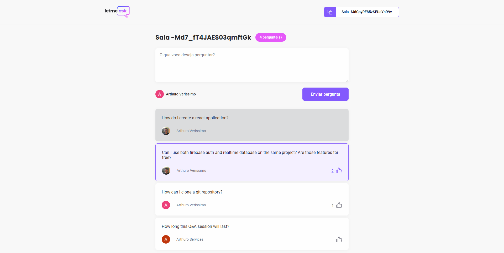

<h1>
    
</h1>

<br>

## 🧪 Tecnologias

This project was developed using the following technologies:

- [React](https://reactjs.org)
- [Firebase](https://firebase.google.com/)
- [TypeScript](https://www.typescriptlang.org/)

## 🚀 How to run the project

Clone the git repository into your local machine.

```bash
$ git clone https://github.com/rocketseat-education/nlw-06-reactjs
$ cd nlw-06-reactjs
```

To run the project you need to follow these steps
```bash
# Instalar as dependências
$ yarn

# Iniciar o projeto
$ yarn start
```
After running those commands the project will be hosted on http://localhost:3000.

Just a reminder that it will be neede to create an account on [Firebase](https://firebase.google.com/) and one project in order to use the Realtime Database that the project needs

## 💻 The Project

Letmeask is perfect for content creators to set up a Q&A session room with the public.

This project was developed during the **[Next Level Week Together](https://nextlevelweek.com/)**, which is like a 5-day bootcamp to develop a react application from scratch.


## 🔖 Layout

You can check the layout of the project in the link below

- [Layout Web](https://www.figma.com/file/u0BQK8rCf2KgzcukdRRCWh/Letmeask/duplicate) 

You'll need to be registered on [Figma](http://figma.com/).

